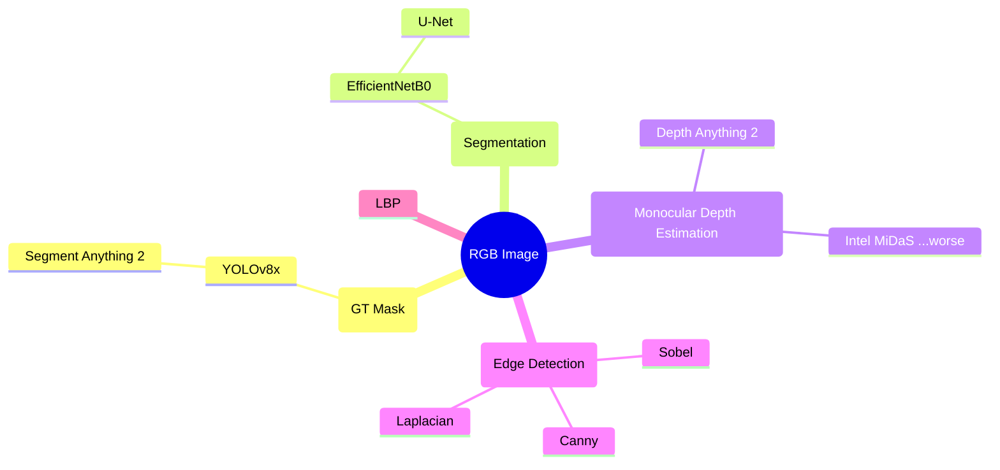
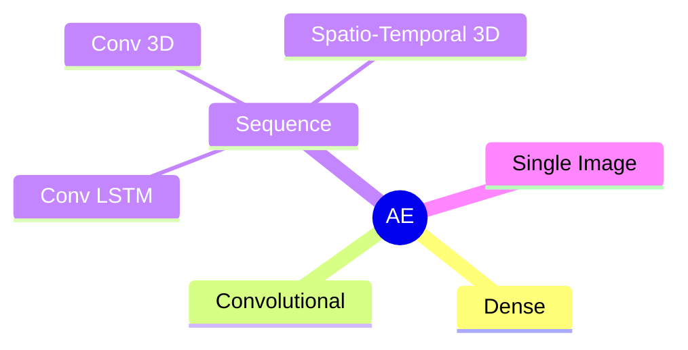
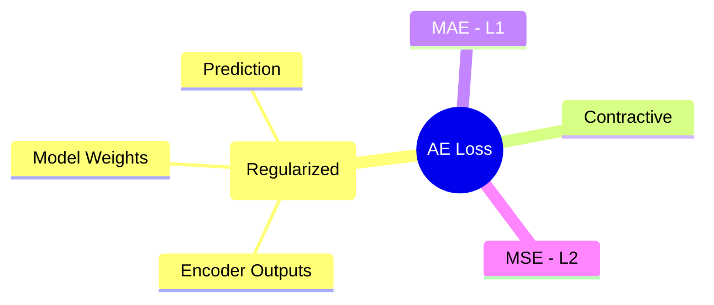

# Driver State Analysis

## 1. Installation

```bash
conda env create -f environment.yml -n driver-state-analysis
```

## 2. High Level Overview

### 2.1. Input Data Processing



### 2.2. Anomaly Detection

#### 2.2.1. Autoencoders



#### 2.2.2. Loss Functions


