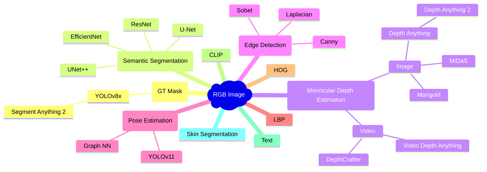

# In-Vehicle Driver State Analysis

[](https://doi.org/10.5281/zenodo.15242002)

This repository contains the supplementary source code for the thesis "In-Vehicle Driver State Analysis Using Image Segmentation".


(Model results on the Driver Monitoring Dataset [[1]](#ref1).)

---

- [1. Project Organization](#1-project-organization)
- [2. Development Environment](#2-development-environment)
- [3. What can we do with an RGB image?](#3-what-can-we-do-with-an-rgb-image)
- [4. References](#4-references)

## 1. Project Organization

- [`model`](model/) - library code
- [`notebooks`](notebooks/) - runnable code, primarily Jupyter notebooks, and Python scripts used to orchestrate notebook execution with different parameters
  - [`notebooks/example`](notebooks/example/) - demonstration of an inference pipeline on sample data. Instructions for running the pipeline are provided [here](notebooks/example/README.md)
  - [`notebooks/datasets`](notebooks/datasets/) - dataset pre-processing
  - [`notebooks/eda`](notebooks/eda/) - exploratory data analysis
  - [`notebooks/sam`](notebooks/sam/) - Segment Anything Model 2 (SAM 2) inference (generation of groud truth masks). This module uses a different virtual environment than the rest of the project, as described [here](notebooks/sam/README.md)
  - [`notebooks/semantic_segmentation`](notebooks/semantic_segmentation/) - semantic segmentation model training, evaluation, and inference
  - [`notebooks/tae`](notebooks/tae/) - training and evaluation of Temporal Autoencoder (TAE)
  - [`notebooks/stae`](notebooks/stae/) - training and evaluation of Spatio-Temporal Autoencoder (STAE)
  - [`notebooks/memory_map`](notebooks/memory_map/) - export training data to continuous memory-mapped files (`np.memmap`) to speed up training and reduce CPU usage, at the cost of increased disk space
  - [`notebooks/clip`](notebooks/clip/) - OpenAI CLIP model (this is excluded from the thesis)

## 2. Development Environment

- Ubuntu 24.04
- CUDA 12.5
- Python 3.12

```bash
conda env create -f environment.yml -n driver-state-analysis
pip install -e .
pre-commit install
```

## 3. What can we do with an RGB image?

The following diagram illustrates a (non-exhaustive) list of different tasks that can be performed using an RGB image as input:



## 4. References

1. <a name="ref1"></a> Ortega, J., Kose, N., Cañas, P., Chao, M.a., Unnervik, A., Nieto, M., Otaegui, O., & Salgado, L. (2020). DMD: A Large-Scale Multi-Modal Driver Monitoring Dataset for Attention and Alertness Analysis. In: A. Bartoli & A. Fusiello (eds), Computer Vision - ECCV 2020 Workshops (pg. 387–405). Springer International Publishing.
2. Ansel, J., Yang, E., He, H., Gimelshein, N., Jain, A., Voznesensky, M., Bao, B., Bell, P., Berard, D., Burovski, E., Chauhan, G., Chourdia, A., Constable, W., Desmaison, A., DeVito, Z., Ellison, E., Feng, W., Gong, J., Gschwind, M., Hirsh, B., Huang, S., Kalambarkar, K., Kirsch, L., Lazos, M., Lezcano, M., Liang, Y., Liang, J., Lu, Y., Luk, C., Maher, B., Pan, Y., Puhrsch, C., Reso, M., Saroufim, M., Siraichi, M. Y., Suk, H., Suo, M., Tillet, P., Wang, E., Wang, X., Wen, W., Zhang, S., Zhao, X., Zhou, K., Zou, R., Mathews, A., Chanan, G., Wu, P., & Chintala, S. (2024). PyTorch 2: Faster Machine Learning Through Dynamic Python Bytecode Transformation and Graph Compilation [Conference paper]. 29th ACM International Conference on Architectural Support for Programming Languages and Operating Systems, Volume 2 (ASPLOS '24). <https://doi.org/10.1145/3620665.3640366>
3. Iakubovskii, P. (2019). Segmentation Models PyTorch (Version 0.4.0) [Computer software]. GitHub. <https://github.com/qubvel/segmentation_models.pytorch>
4. Wolf, T., Debut, L., Sanh, V., Chaumond, J., Delangue, C., Moi, A., Cistac, P., Ma, C., Jernite, Y., Plu, J., Xu, C., Le Scao, T., Gugger, S., Drame, M., Lhoest, Q., & Rush, A. M. (2020). Transformers: State-of-the-Art Natural Language Processing [Conference paper]. 38–45. <https://www.aclweb.org/anthology/2020.emnlp-demos.6>
5. Ravi, N., Gabeur, V., Hu, Y.-T., Hu, R., Ryali, C., Ma, T., Khedr, H., Rädle, R., Rolland, C., Gustafson, L., Mintun, E., Pan, J., Alwala, K. V., Carion, N., Wu, C.-Y., Girshick, R., Dollár, P., & Feichtenhofer, C. (2024). SAM 2: Segment anything in images and videos (arXiv:2408.00714). arXiv. <https://arxiv.org/abs/2408.00714>
6. Yang, L., Kang, B., Huang, Z., Zhao, Z., Xu, X., Feng, J., & Zhao, H. (2024). Depth Anything V2 (arXiv:2406.09414). arXiv. <https://arxiv.org/abs/2406.09414>
7. Jocher, G., Qiu, J., & Chaurasia, A. (2023). Ultralytics YOLO (Version 8.0.0) [Computer software]. <https://github.com/ultralytics/ultralytics>
8. ONNX Runtime Contributors. (2021). ONNX Runtime (Version 1.21.0) [Computer software]. <https://onnxruntime.ai/>
9. ONNX Contributors. (2019). ONNX: Open Neural Network Exchange (Version 1.17.0) [Computer software]. <https://onnx.ai/>
