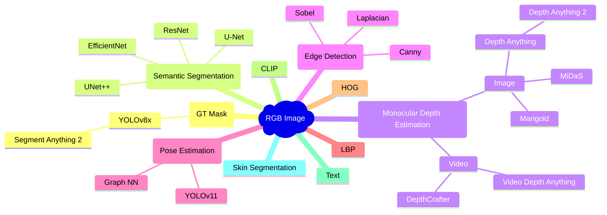

# Driver State Analysis

- [1. Project Organization](#1-project-organization)
- [2. Development Environment](#2-development-environment)
- [3. What can we do with an RGB image?](#3-what-can-we-do-with-an-rgb-image)

## 1. Project Organization

- [`model`](model/) - library code
- [`notebooks`](notebooks/) - runnable code, primarily Jupyter notebooks, and Python scripts used to orchestrate notebook execution with different parameters
  - [`notebooks/example`](notebooks/example/) - demonstration of an inference pipeline on sample data
  - [`notebooks/datasets`](notebooks/datasets/) - dataset pre-processing
  - [`notebooks/eda`](notebooks/eda/) - exploratory data analysis
  - [`notebooks/sam`](notebooks/sam/) - Segment Anything Model 2 (SAM 2) inference (generation of groud truth masks). This module uses a different virtual environment than the rest of the project, as described [here](notebooks/sam/README.md)
  - [`notebooks/semantic_segmentation`](notebooks/semantic_segmentation/) - semantic segmentation model training, evaluation, and inference
  - [`notebooks/tae`](notebooks/tae/) - training and evaluation of Temporal Autoencoder (TAE)
  - [`notebooks/stae`](notebooks/stae/) - training and evaluation of Spatio-Temporal Autoencoder (STAE)
  - [`notebooks/memory_map`](notebooks/memory_map/) - export of training data into continuous memory mapped files (`np.memmap`) to speed up training (and decrease CPU demands) at the cost of increased disk space
  - [`notebooks/clip`](notebooks/clip/) - OpenAI CLIP model (this is excluded from the thesis)

## 2. Development Environment

- Ubuntu 24.04

```bash
conda env create -f environment.yml -n driver-state-analysis
pip install -e .  # library code
pre-commit install  # optional (development)
```

## 3. What can we do with an RGB image?

The following diagram illustrates a (non-exhaustive) list of different tasks that can be performed using an RGB image as input:


