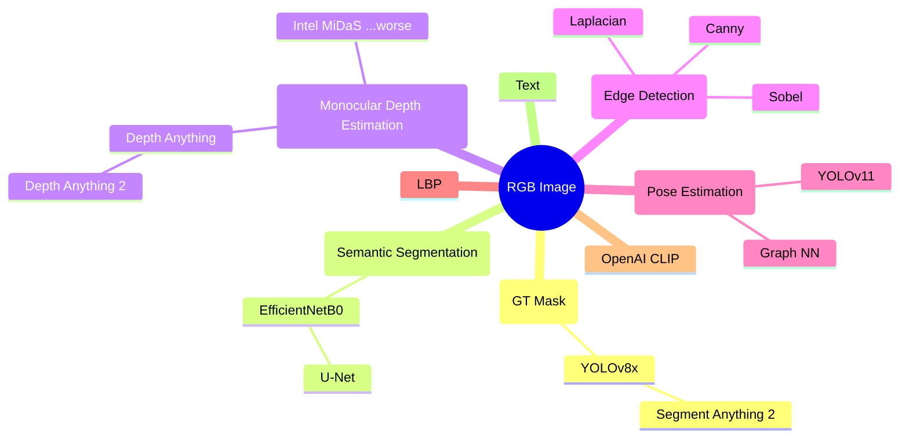
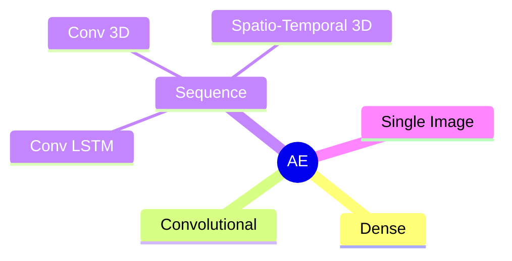
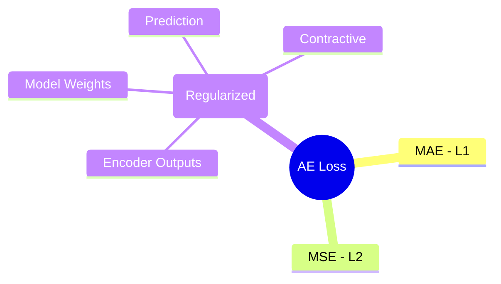

# Driver State Analysis

## 1. Installation

- Ubuntu 24.04

```bash
conda env create -f environment.yml -n driver-state-analysis
pip install -e .
```

## 2. High Level Overview

### 2.1. Input Data Processing



### 2.2. Anomaly Detection

#### 2.2.1. Autoencoders



#### 2.2.2. Loss Functions


